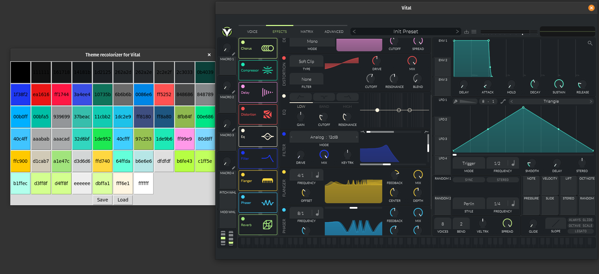
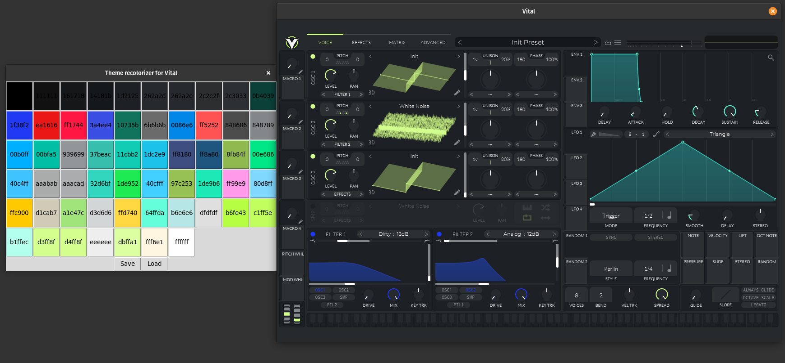

# Skin Recolorizer for Vital

This is a short python program, for adjusting colors from an existing .vitalskin file.

It is not as powerful as the native Vital skin editor, but is a bit easier, it group all the repeated colors so you only have to change them once. Is a good tool if you only want to tweak an existing skin. Or if you want to get started with a new one, this can save you some time.

##  Documentation

### Install and run
Just `clone` the repository and run the [main.py](src/main.py) file via the virtual environment:

```bash
git clone https://github.com/JARA99/Skin_Recolorizer_for_Vital.git
cd ./Skin_Recolorizer_for_Vital
source ./PythonVEnv_SkinRecolorizer/bin/activate
python3 -u './src/main.py'
```

### Usage

Once the program is running, it will show you the [default.vitalskin](src/default.vitalskin) for tweak. But you can select any skin that you want for tweaking, just hit `load` and search your skin.

For changing a color, just click over it, and it will pop a color selector for you. From there, you can change the colors as you wish. 

Also, when you put the mouse over a color, it will change to the original skin color, that way you can compare the changes (if you haven't changed the color, nothing will happen).

When you are done, you can save the new theme with the `save` button. And that's all!

### Configuration

You can change some parameters if you want. On the [`main.py`](src/main.py) document, from the line 7 to 12. You can change the default paths and the number of columns you want, I personally prefer having just 4 columns so i can put vital bigger in my screen and at one side have the skin recolorizer.

```python
############################### Global Const ###############################

DEFAULT_PATH = '..'
DEFAULT_SKIN = './src/default.vitalskin'

COLUMNS = 4
```

Consider adding a folder called `/skins` to your vital directory. You can store the skins there, and Vital will automatically add them to the skin list. You can add the path to that folder to the `DEFAULT_PATH` constant later.

### Screenshots




<br>

---

<br>


## To-Do:

- [ ] Improve the GUI
- [x] Add a load and save path selectors
- [ ] Improve the documentation
- [ ] English revision of the documentation (spanish is my native language)
- [ ] Add a `reset color` button for resetting a color to the original
- [ ] Add a info window, with the synth parts associated to each color.

<br>

---

<br>


## Usage (OldMain)

Once you run the code above, it will be requested a path for loading a skin file. If you leve it in blank it will use the [default.vitalskin](src/default.vitalskin).

Hit `<Enter>` and it will poup-up a widow with the colors of the skin and it's `HEX` codes. From there you can change a color by filling the color number (the one in parenthesis) on the first box and the `HEX` color of the new color on the second box.

Hit the `to:`  button and it will apply the changes. You should see that the color have changed, and now it has a vertical band that indicates the original color.

Once you finish your re colorization you can hit `save` and enter the save path on the terminal.

###  Screenshot

